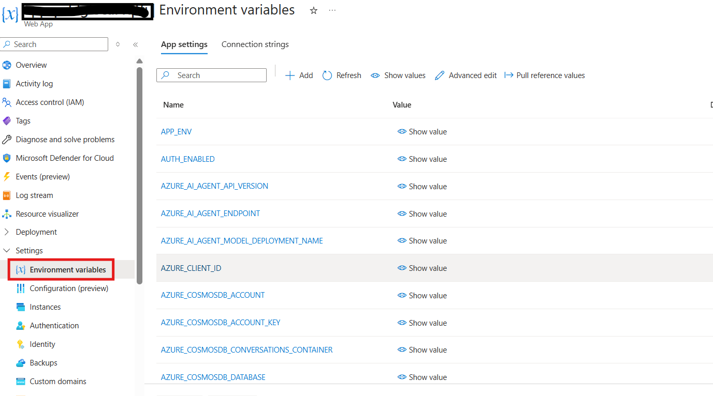

# Local Development Setup Guide

This guide provides comprehensive instructions for setting up the Document Generation Solution Accelerator for local development across Windows and Linux platforms.

## Important Setup Notes

### Multi-Service Architecture

This application consists of **two separate services** that run independently:

1. **Backend API** - REST API server for the frontend
2. **Frontend** - React-based user interface

> **⚠️ Critical: Each service must run in its own terminal/console window**
>
> - **Do NOT close terminals** while services are running
> - Open **2 separate terminal windows** for local development
> - Each service will occupy its terminal and show live logs


### Path Conventions

**All paths in this guide are relative to the repository root directory:**

```bash
document-generation-solution-accelerator/   ← Repository root (start here)
├── src/
│   ├── backend/                            
│   │   ├── api/                            ← API endpoints and routes
│   │   ├── auth/                           ← Authentication modules
│   │   ├── helpers/                        ← Utility and helper functions
│   │   ├── history/                        ← Chat/session history management
│   │   ├── security/                       ← Security-related modules
│   │   └── settings.py                     ← Backend configuration
│   ├── frontend/                           
│   │   ├── src/                            ← React/TypeScript source
│   │   └── package.json                    ← Frontend dependencies
│   ├── static/                             ← Static web assets
│   ├── tests/                              ← Unit and integration tests
│   ├── app.py                              ← Main Flask application entry point
│   ├── .env                                ← Main application config file
│   └── requirements.txt                    ← Python dependencies
├── scripts/                                
│   ├── prepdocs.py                         ← Document processing script
│   ├── auth_init.py                        ← Authentication setup
│   ├── data_preparation.py                 ← Data pipeline scripts
│   └── config.json                         ← Scripts configuration
├── infra/                                  
│   ├── main.bicep                          ← Main infrastructure template
│   ├── scripts/                            ← Infrastructure scripts
│   └── main.parameters.json                ← Deployment parameters
├── docs/                                   ← Documentation (you are here)
└── tests/                                  ← End-to-end tests
    └── e2e-test/                           
```

**Before starting any step, ensure you are in the repository root directory:**

```bash
# Verify you're in the correct location
pwd  # Linux/macOS - should show: .../document-generation-solution-accelerator
Get-Location  # Windows PowerShell - should show: ...\document-generation-solution-accelerator

# If not, navigate to repository root
cd path/to/document-generation-solution-accelerator
```

## Step 1: Prerequisites - Install Required Tools

Install these tools before you start:
- [Visual Studio Code](https://code.visualstudio.com/) with the following extensions:
  - [Azure Tools](https://marketplace.visualstudio.com/items?itemName=ms-vscode.vscode-node-azure-pack)
  - [Bicep](https://marketplace.visualstudio.com/items?itemName=ms-azuretools.vscode-bicep)
  - [Python](https://marketplace.visualstudio.com/items?itemName=ms-python.python)
- [Python 3.11](https://www.python.org/downloads/). **Important:** Check "Add Python to PATH" during installation.
- [PowerShell 7.0+](https://github.com/PowerShell/PowerShell#get-powershell).
- [Node.js (LTS)](https://nodejs.org/en).
- [Git](https://git-scm.com/downloads).
- [Azure Developer CLI (azd) v1.18.0+](https://learn.microsoft.com/en-us/azure/developer/azure-developer-cli/install-azd).
- [Microsoft ODBC Driver 17](https://learn.microsoft.com/en-us/sql/connect/odbc/download-odbc-driver-for-sql-server?view=sql-server-ver16) for SQL Server.


### Windows Development

#### Option 1: Native Windows (PowerShell)

```powershell
# Install Python 3.11+ and Git
winget install Python.Python.3.11
winget install Git.Git

# Install Node.js for frontend
winget install OpenJS.NodeJS.LTS

# Install uv package manager
py -3.11 -m pip install uv
```

**Note**: On Windows, use `py -3.11 -m uv` instead of `uv` for all commands to ensure you're using Python 3.11.

#### Option 2: Windows with WSL2 (Recommended)

```bash
# Install WSL2 first (run in PowerShell as Administrator):
# wsl --install -d Ubuntu

# Then in WSL2 Ubuntu terminal:
sudo apt update && sudo apt install python3.11 python3.11-venv git curl nodejs npm -y

# Install uv
curl -LsSf https://astral.sh/uv/install.sh | sh
source ~/.bashrc
```

### Linux Development

#### Ubuntu/Debian

```bash
# Install prerequisites
sudo apt update && sudo apt install python3.11 python3.11-venv git curl nodejs npm -y

# Install uv package manager
curl -LsSf https://astral.sh/uv/install.sh | sh
source ~/.bashrc
```

#### RHEL/CentOS/Fedora

```bash
# Install prerequisites
sudo dnf install python3.11 python3.11-devel git curl gcc nodejs npm -y

# Install uv
curl -LsSf https://astral.sh/uv/install.sh | sh
source ~/.bashrc
```


## Step 2:  Clone the Repository

Choose a location on your local machine where you want to store the project files. We recommend creating a dedicated folder for your development projects.

#### Using Command Line/Terminal

1. **Open your terminal or command prompt. Navigate to your desired directory and Clone the repository:**
   ```bash
   git clone https://github.com/microsoft/document-generation-solution-accelerator.git
   ```

2. **Navigate to the project directory:**
   ```bash
   cd document-generation-solution-accelerator
   ```

3. **Open the project in Visual Studio Code:**
   ```bash
   code .
   ```


## Step 3: Development Tools Setup

### Visual Studio Code (Recommended)

#### Required Extensions

Create `.vscode/extensions.json` in the workspace root and copy the following JSON:

```json
{
    "recommendations": [
        "ms-python.python",
        "ms-python.pylint",
        "ms-python.black-formatter",
        "ms-python.isort",
        "ms-vscode-remote.remote-wsl",
        "ms-vscode-remote.remote-containers",
        "redhat.vscode-yaml",
        "ms-vscode.azure-account",
        "ms-python.mypy-type-checker"
    ]
}
```

VS Code will prompt you to install these recommended extensions when you open the workspace.

#### Settings Configuration

Create `.vscode/settings.json` and copy the following JSON:

```json
{
    "python.defaultInterpreterPath": "./.venv/bin/python",
    "python.terminal.activateEnvironment": true,
    "python.formatting.provider": "black",
    "python.linting.enabled": true,
    "python.linting.pylintEnabled": true,
    "python.testing.pytestEnabled": true,
    "python.testing.unittestEnabled": false,
    "files.associations": {
        "*.yaml": "yaml",
        "*.yml": "yaml"
    }
}
```

## Step 4: Azure Authentication Setup

Before configuring services, authenticate with Azure:

```bash
# Login to Azure CLI
az login

# Set your subscription
az account set --subscription "your-subscription-id"

# Verify authentication
az account show
```

## Step 5: Local Setup/Deployment

Follow these steps to set up and run the application locally:

## Local Deployment:

You can refer the local deployment guide here: [Local Deployment Guide](https://github.com/microsoft/document-generation-solution-accelerator/blob/main/docs/DeploymentGuide.md)

### 5.1. Open the App Folder
Navigate to the `src` directory of the repository using Visual Studio Code.

### 5.2. Configure Environment Variables
- Copy the `.env.sample` file to a new file named `.env`.
- Update the `.env` file with the required values from your Azure resource group in Azure Portal App Service environment variables.
- You can get all env value in your deployed resource group under App Service:

- Alternatively, if resources were
provisioned using `azd provision` or `azd up`, a `.env` file is automatically generated in the `.azure/<env-name>/.env`
file. To get your `<env-name>` run `azd env list` to see which env is default.

> **Note**: After adding all environment variables to the .env file, update the value of **'APP_ENV'** from:
```
APP_ENV="Prod"
```
**to:**
```
APP_ENV="Dev"
```

This change is required for running the application in local development mode.


### 5.3. Required Azure RBAC Permissions

To run the application locally, your Azure account needs the following role assignments on the deployed resources:

#### 5.3.1. App Configuration Access
```bash
# Get your principal ID
PRINCIPAL_ID=$(az ad signed-in-user show --query id -o tsv)

# Assign App Configuration Data Reader role
az role assignment create \
  --assignee $PRINCIPAL_ID \
  --role "App Configuration Data Reader" \
  --scope "/subscriptions/<subscription-id>/resourceGroups/<resource-group>/providers/Microsoft.AppConfiguration/configurationStores/<appconfig-name>"
```

#### 5.3.2. Cosmos DB Access
```bash
# Assign Cosmos DB Built-in Data Contributor role
az cosmosdb sql role assignment create \
  --account-name <cosmos-account-name> \
  --resource-group <resource-group> \
  --role-definition-name "Cosmos DB Built-in Data Contributor" \
  --principal-id $PRINCIPAL_ID \
  --scope "/"
```
> **Note**: After local deployment is complete, you need to execute the post-deployment script so that all the required roles will be assigned automatically.

### 5.4. Running with Automated Script

For convenience, you can use the provided startup scripts that handle environment setup and start both services:

**Windows:**
```cmd
cd src
.\start.cmd
```

**macOS/Linux:**
```bash
cd src
chmod +x start.sh
./start.sh
```
### 5.5. Start the Application
- Run `start.cmd` (Windows) or `start.sh` (Linux/Mac) to:
  - Install backend dependencies.
  - Install frontend dependencies.
  - Build the frontend.
  - Start the backend server.
- Alternatively, you can run the backend in debug mode using the VS Code debug configuration defined in `.vscode/launch.json`.


## Step 6: Running Backend and Frontend Separately

> **📋 Terminal Reminder**: This section requires **two separate terminal windows** - one for the Backend API and one for the Frontend. Keep both terminals open while running. All commands assume you start from the **repository root directory**.

### 6.1. Create Virtual Environment (Recommended)

Open your terminal and navigate to the root folder of the project, then create the virtual environment:

```bash
# Navigate to the project root folder
cd document-generation-solution-accelerator

# Create virtual environment in the root folder
python -m venv .venv

# Activate virtual environment (Windows)
.venv/Scripts/activate

# Activate virtual environment (macOS/Linux)
source .venv/bin/activate
```

> **Note**: After activation, you should see `(.venv)` in your terminal prompt indicating the virtual environment is active.

### 6.2. Install Dependencies and Run

To develop and run the backend API locally:

```bash
# Navigate to the API folder (while virtual environment is activated)
cd src/

# Upgrade pip
python -m pip install --upgrade pip

# Install Python dependencies
pip install -r requirements.txt

# Install Frontend Packages
cd frontend

npm install
npm run build

# Run the backend API (Windows)
cd ..

start http://127.0.0.1:50505
call python -m uvicorn app:app --port 50505 --reload 

# Run the backend API (MacOs)
cd ..

open http://127.0.0.1:50505
python -m uvicorn app:app --port 50505 --reload

# Run the backend API (Linux)
cd ..

xdg-open http://127.0.0.1:50505
python -m uvicorn app:app --port 50505 --reload

```

> **Note**: Make sure your virtual environment is activated before running these commands. You should see `(.venv)` in your terminal prompt when the virtual environment is active.

The App will run on `http://127.0.0.1:50505/#/` by default.

## Step 7: Verify All Services Are Running

Before using the application, confirm all services are running correctly:

### 7.1. Terminal Status Checklist

| Terminal | Service | Command | Expected Output | URL |
|----------|---------|---------|-----------------|-----|
| **Terminal 1** | Backend API | `python -m uvicorn app:app --port 50505 --reload` | `INFO: Application startup complete` | http://127.0.0.1:50505 |
| **Terminal 2** | Frontend (Dev) | `npm run dev` | `Local: http://localhost:5173/` | http://localhost:5173 |

### 7.2. Quick Verification

**1. Check Backend API:**
```bash
# In a new terminal
curl http://127.0.0.1:50505/health
# Expected: {"status":"healthy"} or similar JSON response
```

**2. Check Frontend:**
- Open browser to http://127.0.0.1:50505 (production build) or http://localhost:5173 (dev server)
- Should see the Document Generation UI
- If authentication is configured, you'll be redirected to Azure AD login

### 7.3. Common Issues

**Service not starting?**
- Ensure you're in the correct directory (`src/` for backend)
- Verify virtual environment is activated (you should see `(.venv)` in prompt)
- Check that port is not already in use (50505 for API, 5173 for frontend dev)
- Review error messages in the terminal

**Can't access services?**
- Verify firewall isn't blocking ports 50505 or 5173
- Try `http://localhost:port` instead of `http://127.0.0.1:port`
- Ensure services show "startup complete" messages

## Step 8: Next Steps

Once all services are running (as confirmed in Step 7), you can:

1. **Access the Application**: Open `http://127.0.0.1:50505` in your browser to explore the Document Generation UI
2. **Explore Sample Questions**: Follow [SampleQuestions.md](SampleQuestions.md) for example prompts and use cases
3. **Understand the Architecture**: Review the codebase starting with `src/backend/` directory

## Troubleshooting

### Common Issues

#### Python Version Issues

```bash
# Check available Python versions
python3 --version
python3.11 --version

# If python3.11 not found, install it:
# Ubuntu: sudo apt install python3.11
# macOS: brew install python@3.11
# Windows: winget install Python.Python.3.11
```

#### Virtual Environment Issues

```bash
# Recreate virtual environment
rm -rf .venv  # Linux/macOS
# or Remove-Item -Recurse .venv  # Windows PowerShell

uv venv .venv
# Activate and reinstall
source .venv/bin/activate  # Linux/macOS
# or .\.venv\Scripts\Activate.ps1  # Windows
uv sync --python 3.11
```

#### Permission Issues (Linux/macOS)

```bash
# Fix ownership of files
sudo chown -R $USER:$USER .

# Fix uv permissions
chmod +x ~/.local/bin/uv
```

#### Windows-Specific Issues

```powershell
# PowerShell execution policy
Set-ExecutionPolicy -ExecutionPolicy RemoteSigned -Scope CurrentUser

# Long path support (Windows 10 1607+, run as Administrator)
New-ItemProperty -Path "HKLM:\SYSTEM\CurrentControlSet\Control\FileSystem" -Name "LongPathsEnabled" -Value 1 -PropertyType DWORD -Force

# SSL certificate issues
python -m pip install uv
```

### Azure Authentication Issues

```bash
# Login to Azure CLI
az login

# Set subscription
az account set --subscription "your-subscription-id"

# Test authentication
az account show
```

### Environment Variable Issues

```bash
# Check environment variables are loaded
env | grep AZURE  # Linux/macOS
Get-ChildItem Env:AZURE*  # Windows PowerShell

# Validate .env file format
cat .env | grep -v '^#' | grep '='  # Should show key=value pairs
```

## Related Documentation

- [Deployment Guide](DeploymentGuide.md) - Instructions for production deployment.
- [Delete Resource Group](DeleteResourceGroup.md) - Steps to safely delete the Azure resource group created for the solution.
- [App Authentication Setup](AppAuthentication.md) - Guide to configure application authentication and add support for additional platforms.
- [Powershell Setup](PowershellSetup.md) - Instructions for setting up PowerShell and required scripts.
- [Quota Check](QuotaCheck.md) - Steps to verify Azure quotas and ensure required limits before deployment.
